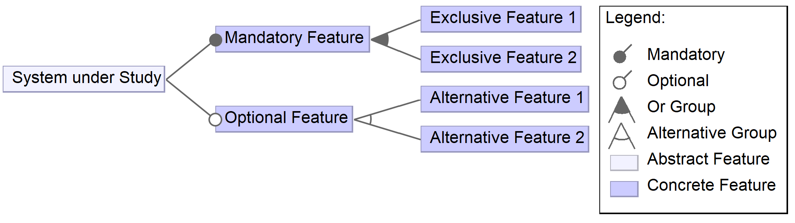

# Event-Driven Message Queuing Architectures in Manufacturing (EDAM-MQ): Feature Models

Feature model of event-driven architectures (EDA) in manufacturing based on the message queuing (MQ) paradigm. This repository contains the feature models described in the paper:

> Gudenkauf, Stefan; Franke, Javier; Behrens, Janek (2023): Features of Event-Driven Message Queuing Architectures in Manufacturing: A Reference Model for Comparison. *INFORMATIK 2023 - Designing Futures: Zukünfte gestalten*. DOI: [10.18420/inf2023_149](https://doi.org/10.18420/inf2023_149). Bonn: Gesellschaft für Informatik e.V.. PISSN: 1617-5468. ISBN: 978-3-88579-731-9. pp. 1435-1451. Ökologische Nachhaltigkeit - Zukunft nachhaltig gestalten durch digitalisierte Wertschöpfungsprozesse (DigiWe). Berlin. 26.-29. September 2023

## Overview

The increasing complexity of manufacturing processes, coupled with trends such as Industry 4.0 and edge computing, has made event-driven architectures a key enabler for efficient and scalable systems. This repository provides a consolidated **Feature Model (EDAM-MQ)** that can be used to uniformly describe, compare, and evaluate event-driven message queuing systems in manufacturing.

### Features of the EDAM-MQ Model

The consolidated feature model is organized into four main groups:

1. **Use Case Features**: Common applications, including activity tracking, user notification, metrics logging, and industrial edge device connectivity.

2. **Architecture-related Features**: Deployment models (cloud or on-premise), cluster management, native protocols, and client interaction models.

3. **System Realization Features**: Compatibility with cloud providers, device management, licensing information, and implementation details.

4. **Quality of Service Features**: Delivery guarantees, message ordering, security mechanisms, and performance optimizations.

### Files and Folder Structure

```
edam-mq-featuremodel/
├─ EDAM_MQ_Feature_Models/
│  ├─ configs/
│  ├─ models/
│  │  ├─ concepts/
│  │  ├─ systems/
│  │  ├─ edam-mq.xml
│  │  ├─ example.xml
├─ .gitignore
├─ images/
├─ README.md
```

- `EDAM_MQ_Feature_Models/`
  - The top-level feature model project.

- `config/`
  - Contains information about which features are enabled or disabled. The default configuration is `default.xml`

- `models/`
  - Contains XML files representing the individual feature models.

- `concepts/`
  - Feature models derived from **surveyed conceptual models** based on the message queuing (MQ) paradigm.

- `systems/`
  - Feature models derived from **surveyed software systems** based on the message queuing (MQ) paradigm.

- `edam-mq.xml`
  - The consolidated **reference model** for event-driven message queuing architectures in manufacturing.

- `example.xml`
  - A self-explanatory example of a feature model.




## Getting Started

1. Clone the repository:
   
```bash
git clone https://github.com/<your-repo>/event-driven-mq-features.git
```

2. Explore the feature models in the `models/` directory.

3. Use [FeatureIDE](https://featureide.github.io/) to visualize and interact with the models.

## Usage

### Tool Support
The feature models are designed to be compatible with [FeatureIDE](https://featureide.github.io/), an open-source tool for feature-oriented software development. The FeatureIDE web site provides [several introductory slides and a step-by-step tutorial](https://featureide.github.io/#documentation), as well as downloads for [prepackaged versions](https://featureide.github.io/#download) of the tool.


### Visualization

To be done...

### Application Scenarios

- Comparative analysis of existing message queuing systems

- Evaluation of architectural needs for manufacturing solutions

- Basis for future research on event-driven architectures in industrial production


## Citation
If you use the feature models in your research or projects, please cite the original paper:

> Gudenkauf, Stefan; Franke, Javier; Behrens, Janek (2023): Features of Event-Driven Message Queuing Architectures in Manufacturing: A Reference Model for Comparison. *INFORMATIK 2023 - Designing Futures: Zukünfte gestalten*. DOI: [10.18420/inf2023_149](https://doi.org/10.18420/inf2023_149). Bonn: Gesellschaft für Informatik e.V.. PISSN: 1617-5468. ISBN: 978-3-88579-731-9. pp. 1435-1451. Ökologische Nachhaltigkeit - Zukunft nachhaltig gestalten durch digitalisierte Wertschöpfungsprozesse (DigiWe). Berlin. 26.-29. September 2023


```java
@incollection{incollection,
author = "Gudenkauf, Stefan and Franke, Javier and Behrens, Janek",
title = "Features of Event-Driven Message Queuing Architectures in Manufacturing: A Reference Model for Comparison",
year = 2023,
doi = "10.18420/inf2023_149",
booktitle = "INFORMATIK 2023 - Designing Futures: Zukünfte gestalten",
publisher = "Gesellschaft für Informatik e.V.",
address = "Bonn",
pissn = "1617-5468",
isbn = "978-3-88579-731-9",
pages = "1435--1451",
}
```

## License
This repository is licensed under the [MIT License](https://opensource.org/license/mit).

## Acknowledgments

This work is supported by the German Federal Ministry for Economic Affairs and Climate Action (BMWK) under grant No. 01MD22001B as part of the "Edge Data Economy" technology program.

